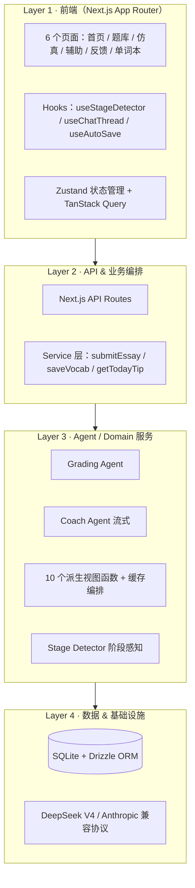
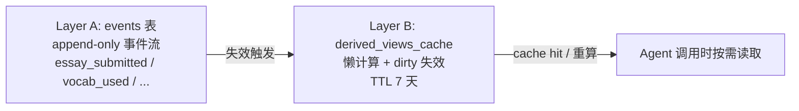
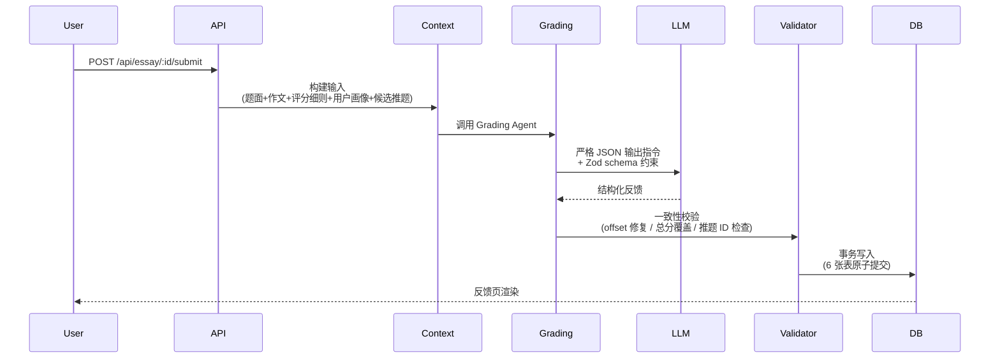

# 雅思写作 AI Agent · IELTS Writing Agent

> 一个面向中国雅思考生的 AI 写作陪练系统。**不只是批改，而是用画像驱动的个性化反馈闭环，帮助卡在 6.5-7.5 平台期的考生突破瓶颈。**


---

## 📌 项目定位

市面上的 AI 写作工具大多停留在 "给一篇作文 → 输出分数" 的浅层服务。但作为一个曾经备考雅思的学习者，我清楚：

**真正的卡点不是分数，而是结构化的成长路径。**

> "我知道我的 Lexical Resource 是 6.0，但下一步具体该练什么？我该背更多词，还是改变现有词的使用方式？"

这个项目想回答的就是这类问题——通过**用户画像驱动的多 Agent 协作系统**，让 AI 不只看一篇作文，而是看到一个完整的、不断成长的学习者。

---

## ✨ 核心特性

### 🎯 1. 双模式写作训练

- **仿真模式**：40 分钟倒计时、字数监控、提交后一次性获得完整反馈，复现真实考试场景
- **辅助模式**：写作过程中可随时呼叫 AI 教练（Coach Agent），获得引导式建议而非直接答案


### 📊 2. 四维评分 + 结构化反馈

提交作文后，系统在 ~30 秒内返回：

- **Task Achievement / Coherence & Cohesion / Lexical Resource / Grammatical Range** 四项分项 + 总分
- **错误定位**：精确到字符偏移的错误高亮，分类（时态/冠词/Chinglish 等）
- **段落改写示范**：选 2-4 个段落，给出 Band 7+ 级别的重写并标注高级表达
- **个性化推题**：基于本次作文暴露的弱项，从题库精选 3 道针对性题目
- **汉译英片段**：针对薄弱话题生成的中译英练习


### 🧠 3. 画像驱动的个性化

系统跟踪用户的：
- **频繁错误模式**（如反复出现的冠词错误）
- **词汇活跃度**（哪些收藏的词已被使用、哪些还没用）
- **风格画像**（平均句长、复杂句比例、连词偏好）
- **进步趋势**（14 天内 4 项分项的轨迹）

这些"画像切片"会被注入到 Grading Agent 和 Coach Agent 的 prompt 中，让反馈具备**记忆**和**针对性**。

### 📚 4. 单词本 → 复现闭环

用户在反馈中收藏的词条会被注入到后续 Agent 调用的上下文中。这是产品独有的**"看到 → 收藏 → 在下一次反馈中被使用"**的学习闭环，把单词本从"被遗忘的列表"变成"主动巩固的素材"。

---

## 🏗️ 系统架构

### 4 层架构



### 数据双层模型：Layer A（事件流） + Layer B（派生视图）

**这是这个项目最得意的架构决策之一。**



**设计理念**：
- **Layer A 是真相**——所有用户行为以事件形式不可变记录
- **Layer B 是视图**——10 个派生视图函数（错误聚合、风格画像、进步趋势...）按需计算，结果缓存
- **事件入库时不主动更新视图**，只标记 `dirty=true`；下次 Agent 调用时若 dirty 才重算
- **避免了"事件 → 视图"的级联更新风暴**，单用户场景下视图重算频率自然合并

---

## 🎯 关键技术决策

> **每个决策都附理由——这部分是面试中我最希望被追问的内容。**

### 选了什么 · 为什么

| 选择 | 备选 | 决策依据 |
|---|---|---|
| **Next.js 15 App Router** | Vite + Express 分离 | 单用户本地 demo 阶段，前后端拆分是负担；Next API Routes 一份代码省掉一个故障源 |
| **SQLite + Drizzle ORM** | Postgres / Prisma | 零部署运维；Drizzle 类型推导比 Prisma 强、无 schema 文件 + 代码生成步骤 |
| **直接调用 LLM SDK** | LangChain / LlamaIndex | LangChain 抽象层让 prompt 调试变难；项目只有 2 个 Agent，不需要 chain 编排框架 |
| **DeepSeek V4 + Anthropic 兼容协议** | OpenAI SDK / 各家 SDK 混用 | DeepSeek 同时支持 OpenAI / Anthropic 两种端点；选 Anthropic 兼容只改 baseURL 即完成迁移，**零代码改动**（成本降低 95%）|
| **流式 SSE 输出（Coach）** | WebSocket | 对话场景单向流足够，HTTP/1.1 原生支持，无握手开销 |
| **Zustand + TanStack Query** | Redux Toolkit | Zustand 处理本地态 + Query 处理远程态，分工清晰，比 Redux 简洁 5x |
| **Zod 同时做类型 + 校验** | TypeScript interface + Yup | Single source of truth：编译时类型 + 运行时校验一份代码 |
| **shadcn/ui** | MUI / Ant Design | 复制源码到本项目模式，定制无障碍；MUI 包大且自由度低 |

### 没选什么 · 为什么

**没选 Python 后端**：虽然 LangChain / LlamaIndex 在 Python 生态更繁荣，但
1. 决定不用 LangChain 后，"Python 生态优势"消失大半
2. 前端必然是 TS（React 没法回避），后端再用 Python 意味着两份类型定义手工同步
3. Claude Code 在 TypeScript 上的输出质量统计上更高（TS 编译期就能拦截 30%+ 低级错误）

**没选向量数据库**：题库 + 句子骨架库总量不超过 1000 条，sqlite-vec 嵌入扩展足够；引入 Pinecone / Weaviate 是 over-engineering。

**没做完整测试覆盖**：单用户本地 demo 阶段，测试 ROI 不高；只对核心路径（事务原子性、字数守卫、Zod schema 校验）有兜底保护。

---

## 🤖 Agent 设计

### Grading Agent：结构化输出 + 严格约束



**关键设计点**：

1. **严格 JSON Schema 约束**：用 Zod 同时做 TypeScript 类型 + 运行时校验，LLM 输出格式异常时立即抛错，不让脏数据入库
2. **一致性校验层**：LLM 偶尔会编造 offset 或 questionId，校验层会用 `indexOf` 修复 offset、剔除非法推题 ID
3. **事务原子性**：6 步独立写入（grading_results + essay_errors + essay_rewrites + recommended_questions + translation_drills + essays.status）必须**全成功或全回滚**——这是个真 bug 修复，详见"踩坑记录"

### Coach Agent：阶段感知 + 流式响应

Coach Agent 的核心约束是 **"陪练 ≠ 代笔"**——绝不替用户写完整范文。

通过 **7 个写作阶段（Stage Overlay）** 实现：

```
blank → stance_undecided → outline_drafting → intro_writing 
     → body_writing → near_completion → completed
```

每个阶段触发不同的 prompt 行为：
- **blank**：只问立场，不给结构
- **outline_drafting**：可建议 2 个候选论点
- **body_writing**：除非用户问，否则保持沉默；如发现用户跑题则温和提示
- **near_completion**：主动催收尾
- **completed**：拒绝再修改，引导提交批改

前端 `useStageDetector` 基于字数 + 正则模式实时判断阶段（纯前端，零 LLM 开销），通过 user message 注入到 Coach Agent。

### Prompt 工程：从内联到独立文件

项目早期所有 prompt 字符串内联在业务代码里。后期重构为：

```
src/lib/agents/prompts/
├── grading-system.ts          # Grading Agent 系统提示词
├── grading-user-message.ts    # 用户消息模板（动态拼接）
├── coach-system.ts            # Coach Agent 基础系统提示
├── coach-stage-overlays.ts    # 7 个阶段的差异化指令
├── coach-user-message.ts      # 上下文消息模板
└── judge-system.ts            # Layer 2 Harness 评估专用
```

每个文件顶部带版本号 + 校准日期 + Change log，**让 prompt 改动可独立 commit、可 diff、可回滚**。

---

## 🛡️ 工程实践

### 输入防御

虽然是本地 demo，仍保留了三道防御：

1. **字数下限统一为 150 词**（前端按钮 + Toast + 后端守卫三处对齐）
2. **字数上限 600 词**（前端禁用 + 后端拒绝），防止误粘贴长文档
3. **Token 估算日志**：每次 LLM 调用前打印 `est input tokens: N`，让看不见的成本变可见

### 错误处理矩阵

| 错误类型 | 处理策略 |
|---|---|
| Anthropic 5xx | 指数退避重试 2 次（1s, 2s） |
| Anthropic 429 | 同上 + 提示用户 |
| LLM JSON 解析失败 | 不重试（再调一次大概率同问题），抛错 + 友好提示 |
| Schema 校验失败 | 记录 issues 到日志，返回 502 |
| LLM 编造 questionId | 校验层拦截，抛错防止用户跳转 404 |
| SQLite BUSY | 重试 3 次（50/100/200ms） |
| 流式 SSE 中断 | 不重试，提示用户重发 |

### 事务保证

`saveGradingResult` 使用 `better-sqlite3` 同步事务包裹 6 步写入：

```typescript
db.transaction((tx) => {
  tx.insert(gradingResults).values({ ... }).run();
  if (output.errors.length > 0) tx.insert(essayErrors).values([...]).run();
  if (output.rewrites.length > 0) tx.insert(essayRewrites).values([...]).run();
  if (output.recommendedQuestions.length > 0) tx.insert(recommendedQuestions).values([...]).run();
  if (output.translationDrills.length > 0) tx.insert(translationDrills).values([...]).run();
  tx.update(essays).set({ state: "graded" }).where(eq(essays.id, essayId)).run();
})();
```

**关键 trap**：`better-sqlite3` 的事务回调必须是**同步函数**，不能用 `async/await`。Drizzle 默认事务签名是 async 的，这里坑过我一次（详见踩坑记录）。

---

## 📖 开发历程（踩过的真坑）

> 这部分是我最重视的——一份诚实记录踩坑的 README 比纯吹优点更能说明工程能力。

### 1. PRD → 技术文档 → 代码的三阶段

我没有直接打开 Cursor / Claude Code 就开写。完整流程：

1. **PRD v0.4**（30 页）：定义产品形态、用户故事、功能详细设计、画像系统、Harness 评测体系
2. **技术文档 v1.0**（173 页）：每个技术选型给出理由、完整 schema、关键 Agent prompt、错误处理矩阵、22 章 + 4 附录
3. **Claude Code 实施**：按附录 A 的 30+ 步任务序列拆解，每步独立 commit + 人工 review

📎 [PRD v0.4 文档](docs/IELTS_Writing_Agent_PRD_v0_4.docx)  
📎 [技术文档 v1.0](docs/IELTS_Writing_Agent_Tech_Spec_v1_0.docx)

### 2. "No text block in response" 错误：4 小时的诊断

**症状**：模型切到 DeepSeek 后，Grading Agent 调用直接报错 `No text block in response`。

**初步排查**：以为是 API key 错、模型名错、网络问题、SDK 兼容性问题——全部排除。

**最终根因**：`new Anthropic({...})` 客户端实例化时**没传 `baseURL` 参数**，请求仍然发到 `api.anthropic.com`，DeepSeek key 鉴权失败但 SDK 解析时返回了空 response 而不是 401。

**修复**：
```typescript
const client = new Anthropic({
  apiKey: env.ANTHROPIC_API_KEY,
  baseURL: env.ANTHROPIC_BASE_URL,  // ← 关键这一行
});
```

**教训**：SDK 默认值不会读环境变量。任何用第三方 OpenAI / Anthropic 兼容端点的项目都要显式传 baseURL。

### 3. 事务被悄悄拆掉的 bug

代码评审时发现：`saveGradingResult` 里原本有 `db.transaction()` 包裹，后来被改成 6 步独立 await。

**根因推测**：Claude Code 实现时用了 async/await 写事务，`better-sqlite3` 报错，它没耐心修就把事务整个去掉了。

**修复**：用同步事务回调，去掉所有 await，配合 Drizzle 0.45+ 的 `.run()` API。

**教训**：AI 工具会"绕过"难题而不是解决——必须人工 review 关键逻辑。

### 4. 80 秒批改延迟（已识别，未修复）

DeepSeek V4-flash 单次 Grading 调用约 80 秒。怀疑原因：
- 默认走了思考模式（reasoning_content 隐藏耗时）
- max_tokens=4096 偏大，模型可能跑满
- 输入 prompt 可能包含冗余的派生视图字段

**当前状态**：诊断脚本已写好，因优先验证产品价值而暂未深入排查。这是有意识的 trade-off：先确保产品能用，再优化体验。

### 5. 从 Anthropic 到 DeepSeek 的 5 分钟迁移

发现 DeepSeek 提供完整的 Anthropic API 兼容端点后，**整个迁移只改了 3 个环境变量**：

```bash
ANTHROPIC_BASE_URL=https://api.deepseek.com/anthropic
ANTHROPIC_API_KEY=<DeepSeek key>
GRADING_MODEL=deepseek-v4-flash
```

**零代码改动，月成本从 ~$120 降到 ~$5**。这告诉我：选 SDK 时要考虑"协议兼容性"而不只是"哪家好用"。

---

## 🚧 当前限制 · 后续规划

### 已知限制

1. **派生视图的 LLM 蒸馏部分未实现**：8 个 SQL 视图正常工作，但 4 个需要 LLM 蒸馏的视图（vocab-habits / style-profile / recent-weak-areas / today-tip）尚未补全 LLM 调用。冷启动用户可优雅降级到 SQL 视图。
2. **零测试覆盖**：核心逻辑无自动化测试，依赖人工冒烟测试。
3. **Grading 延迟 ~80 秒**：DeepSeek V4-flash 实际响应慢于预期，反馈页等待体验差。
4. **无鉴权**：所有 API 公开，单用户本地 demo 阶段可接受，多用户上线前必须加。
5. **题库初始化简陋**：MVP 阶段题库只有 ~30 道，需扩充至 200+ 才能满足真实学习需求。

### 后续优先级

**P0（必须做）**：
- 诊断并优化 Grading 延迟（80s → 目标 <30s）
- 补齐 4 个 LLM 派生视图（影响个性化质量）

**P1（应该做）**：
- 关键路径测试（Zod schema / 事务回滚 / 字数守卫）
- 反馈页等待态优化（进度文案 / 超时兜底）
- React Error Boundary 防白屏

**P2（可以做）**：
- 多用户支持 + 基础鉴权
- 题库扩充到 200+ 道（含 Task 1 图表题）
- Harness Layer 1 评测体系（30 篇标注作文跑批，验证评分准确性）

---

## 🚀 快速开始

### 前置要求

- Node.js ≥ 20.10 LTS
- DeepSeek API Key（[申请地址](https://platform.deepseek.com/api_keys)）

### 启动步骤

```bash
# 1. 克隆仓库
git clone https://github.com/LinanChunyu/yasi-writing-agent.git
cd yasi-writing-agent/ielts-writing-agent

# 2. 安装依赖
npm install

# 3. 配置环境变量
cp .env.example .env.local
# 编辑 .env.local 填入：
# ANTHROPIC_API_KEY=<你的 DeepSeek key>
# ANTHROPIC_BASE_URL=https://api.deepseek.com/anthropic
# GRADING_MODEL=deepseek-v4-flash
# COACH_MODEL=deepseek-v4-flash

# 4. 初始化数据库
npm run db:migrate
npm run db:seed

# 5. 启动 dev server
npm run dev

# 6. 浏览器打开 http://localhost:3000
```

### 第一次使用

1. 进首页 → 点"随机来一题（仿真）"
2. 40 分钟内写完一篇 ≥150 词的作文
3. 提交 → 等待 ~30 秒 → 查看反馈页
4. 在反馈页收藏感兴趣的高级表达到单词本
5. 写第二篇时，会发现收藏的词被 Agent 自然地用进改写示范中——形成学习闭环

---

## 📂 项目结构

```
ielts-writing-agent/
├── src/
│   ├── app/                       # Next.js App Router 页面 + API Routes
│   │   ├── (app)/                 # 主应用路由组
│   │   │   ├── write/real/        # 仿真模式
│   │   │   ├── write/assist/      # 辅助模式
│   │   │   ├── feedback/          # 反馈页
│   │   │   ├── wordbook/          # 单词本
│   │   │   └── question-bank/     # 题库
│   │   └── api/                   # 后端 API 路由
│   ├── components/                # React 组件 + shadcn/ui
│   ├── hooks/                     # 自定义 hooks
│   ├── lib/
│   │   ├── agents/                # Agent 核心
│   │   │   ├── prompts/           # ✨ Prompt 独立文件（可单独迭代）
│   │   │   ├── grading-agent.ts   # Grading Agent 实现
│   │   │   └── coach-agent.ts     # Coach Agent 流式实现
│   │   ├── derived-views/         # 10 个画像视图函数
│   │   ├── repositories/          # 数据访问层（事务封装）
│   │   ├── services/              # 业务编排层
│   │   ├── stage-detector.ts      # 写作阶段判断
│   │   └── utils/
│   ├── db/
│   │   ├── schema.ts              # Drizzle ORM schema（19 张表）
│   │   ├── migrations/
│   │   └── seed/                  # 题库 / 评分细则 / 句子骨架种子数据
│   └── stores/                    # Zustand 客户端状态
├── docs/                          # PRD + 技术文档 + 截图
└── data/                          # SQLite 数据库（.gitignore）
```。

---


## 🙏 致谢

- **Claude / Claude Code**：实现期间最重要的 pair programmer
- **DeepSeek**：高质量低成本的 LLM 服务，让个人项目可持续
- **shadcn/ui**：React 组件库的天花板
- **Drizzle ORM**：让 SQLite + TypeScript 的组合无比丝滑
